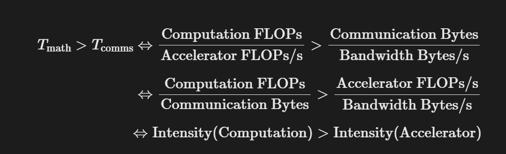

#### Intro to Rooflines

> Typically (but not always), computation within a single chip can be overlapped with communication within a chip and between chips. This means **we can lower-bound training and inference time by using the maximum of computation and communication time**. We can also **upper-bound with their sum**. In practice, we optimize against the maximum as the algebra is simpler and we can usually come close to this bound by overlapping our communication and computation.

意思是以 $max(T_{math}, T_{comms})$ 这个值为衡量系统性能的理想极限，也就是下界，努力让运行时间接近这个值。 上界是 $T_{math} + T_{comms}$. 既然计算和通信可以同时进行，那这个任务理论上最快也要花掉两者中耗时更长的那个时间。优化代码时尽力让 computation 和 communication 是 overlapped 的。

一个比较有意思的事情是，我们一般讲 memory-bound，但是这里都用 communication-bound 代替了，是有点小巧思的。一个可能的原因是本书侧重于 scaling，而对于单卡下没有什么太大区别的 memory 和 communication 在卡与卡之间用 communication 是一个更好的称谓。LLM 对此的评价是”网络即内存“。

这个公式区分了 FLOPs 和 FLOPs/s, Communication 和 Bandwidth 的区别。上方是理论计算时间与理论通信时间，进行交叉相乘的变形后得到 算法计算强度 > 硬件机器强度 的结论。所以判断一个程序是卡在算力还是显存，和程序的计算强度是否高于这个显卡平衡点的门槛是相关的。

此处 back-of-the-envelope calculation 得到了大多数机器很难达到 compute-bound 的事实。

A Few Problems to Work 的 Question 2 问，如果用 int8 权重量化但是保持激活值和计算是 bf16，如何衡量计算限制？我们计算 $X[B,D] \cdot Y[D,F] \rightarrow Z[B,F]$，其中 $X[B,D]$ 是 input activation 是动态变化的，而 $Y[D,F]$ 是 weight 是模型训练好之后固定下来的参数，负责把 $D$ 维的向量映射为 $F$ 维的向量，是静态的。$Z[B,F]$ 是 output activation.

可以理解 $B$ 是 Batch Size，那末 $X[B,D]$ 就是输入 $B$ 个 Token 而每个 Token 变成了一个长度为 $D$ 的向量，然后将 $D$ 维度向量映射为 $F$ 维。假设 Batch Size ($B$) 非常小，即 $B \ll D$ 且 $B \ll F$，以 LLaMA-7B 举例，假设隐藏层维度 $D = 4000, F = 4000$，在对话推理 Generation 时每次只吐出一个词，此时 Batch Size $B = 1$，可以计算得到搬运权重 $Y(DF)$ 和输入激活值 $X(BD)$、输出激活值 $Z(BF)$ 有大约四个数量级的差距。

激活值 $X$ 对应 $B \times D \times 2$ bytes (bf16) $= 2BD$，权重 $Y$ 对应 $D \times F \times 1$ byte (int8) $= DF$，写回 $Z = B \times F \times 2$ bytes(bf16) $= 2BF$，总访存量应该是 $= 2BD + DF + 2BF$。对于批量较小假设得到总访存 $\approx DF$。 得出的算数强度就是 $= 2BDF / DF = 2B$，若为纯 bf16 则为 $B$。

#### Shared Matmuls

此处主要是理解分片矩阵的计算机制。对于 $A[I,J]$：

可以做 $A[I_X,J]$ 进行分区，那么在逻辑轴 $I$ 上沿着 $X$ 维度切开，但是 $J$ 不切分。

$A[I_X,J]$ 的意思是左右 ($X$) 的机器拿到不同的数据，而上下的 ($Y$) 机器拿到相同的数据，也就是在 $Y$ 上将获得完整的副本。由此就可以理解 $A[I_Y,J]$ 了，上下 ($Y$) 的机器拿到不同的数据。$A[I_Y,J_X]$ 可以先从 $I$ 上沿着 $Y$ 切，再从 $J$ 上沿 $X$ 切，我觉得把沿 $X$ 和沿 $Y$ 理清就不会对此有太大的疑惑。

这是理解 shared dimension multiplication 的基础，对于被收缩 (sharded) 的矩阵：

$A[I, J_X] \cdot B[J,K] \rightarrow C[I,K]$

通常来说，

$AllGather_X[I,J_X] \rightarrow A[I,J]$
$A[I,J] \cdot B[J,K] \rightarrow C[I,K]$

AllGather 是一种移除沿某个轴分片的 MPI communication primitive，通过数学可以证明，类似的通信原语的通信时间都是仅取决于数组的大小 $V$（数组字节数）和 ICI 可用带宽 $W_{ici}$，而不取决于数组分片数量 $X$，公式 $T_{total} = \frac{V}{W_{ici}}$.

关于延迟的一些具体内容有些复杂，暂时搁置它。

上述内容讨论的是只有一个乘数的维度被分片的情况，如果是两个乘数的收缩维度被分片，

$A[I,J_X] \cdot B[J_X,L] \rightarrow C[I,K]$

此时局部分片的矩阵乘法是可行的，我们可以这么做：

$A[I,J_X] \cdot_{LOCAL} B[J_X,L] \rightarrow C[I,K]\{U_X\}$

$C[I,K]$ 沿着 $X$ 网络还未作归约，可以认为处于”未完成“状态。这可以被理解为一种**外积**，外积即 $A$ 的每一列与 $B$ 的每一行做外积，得到 $P$ 个同等大小的大矩阵，把它们按位置相加，结果和常规矩阵乘法一模一样。执行这种求和也就是：

$AllReduce_Y A[I_X,J]\{U_Y\} \rightarrow A[I_X,J]$

AllReduce 的执行方式可以理解为，每个设备将其分片发送给相邻设备，并对接收到的所有分片进行求和。通常 AllReduce 的成本是 AllGather 的两倍，可以认为 AllReduce 是两个原语的组合——ReduceScatter 和 AllGather。

$ReduceScatter_{Y,J}: A[I_X,J]\{U_Y\} \rightarrow A[I_X,J_Y]$
$AllGather_Y: A[I_X,J_Y] \rightarrow A[I_X,J]$

ReduceScatter 对一个未归约/部分求和的数组进行求和，然后沿着相同的网格轴分散 (scatters or shards) 不同的逻辑轴。AllGather 重组了一个分片数组（移除下标）。AllGather 和 ReduceScatter 的通信开销是 $\frac{V}{W_{ici}}$，AllReduce 是 $2 \cdot \frac{V}{W_{ici}}$.

另外 AllToAll 也是一种通信原语，沿同一轴收集（复制）一个维度，并分片另一个维度。可以写为 $[A, B_X] \rightarrow [A_X, B]$.

一些内容此处没有提及，在后面的篇章还会提到。此处总结一些比较贴近直觉的观点：

HBM (显存) > NVLink (机内互联) > PCIe (连接CPU) > InfiniBand / RDMA (机间互联)。比如 TP 一般在同一机器（同一 Node）的几张卡内做 AllReduce，走 NVLink。跨机器一般做 PP 或者 DP。

还有就是利用通信与计算的重叠 overlap 掩盖延迟问题。